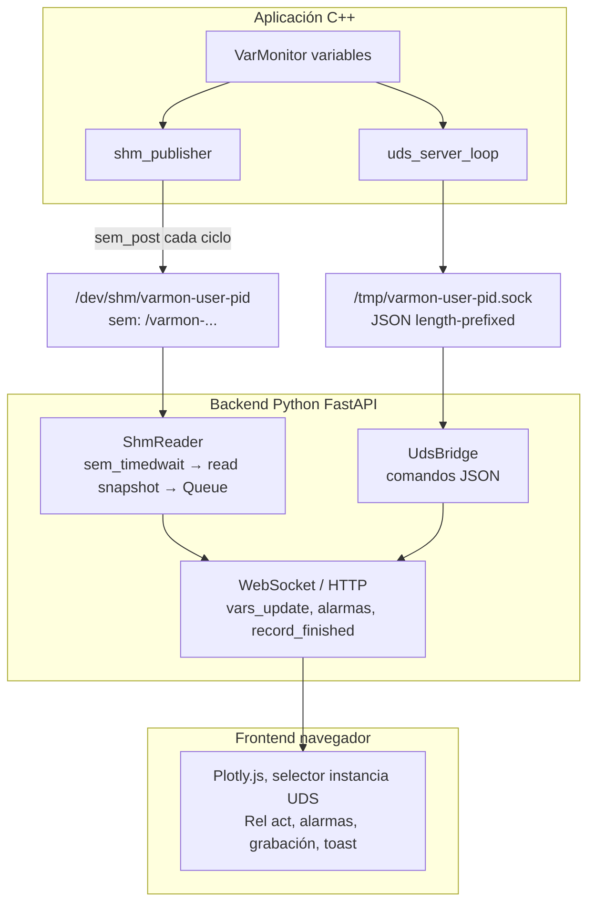

# Arquitectura general

VarMonitor conecta una aplicación C++ con una interfaz web sin usar TCP entre C++ y Python: todo es local mediante **UDS** y **SHM**.

## Diagrama de componentes y flujo de datos

- **Sin TCP** entre C++ y Python: no hay puertos de red; todo es UDS + SHM en la misma máquina.
- **web_port** en `varmon.conf` es solo el puerto HTTP/WebSocket del servidor web (Python).

## Backend web: núcleo y extensiones

El repositorio público incluye el servidor FastAPI (`web_monitor/app.py`), el registro de plugins (`plugin_registry`) y un stub vacío si no hay paquete adicional. Las APIs de registros de protocolo (ARINC / MIL-STD-1553), Git UI, terminal, GDB y la implementación Parquet del servidor se cargan mediante el paquete Python opcional bajo `tool_plugins/python` (por ejemplo `pip install -e tool_plugins/python`). Sin ese paquete el monitor sigue funcionando con variables, grabaciones TSV, WebSocket y las rutas documentadas en [Backend (Python)](backend.md) como núcleo MIT. Detalle en la sección «Paquete opcional `varmonitor_plugins` (Pro)» de `backend.md`.

## Descubrimiento de instancias

No se explora la red por IP/puerto. Las instancias C++ se descubren por **sockets Unix** en `/tmp`:

1. **Patrón de nombres**: `/tmp/varmon-<user>-<pid>.sock`
   - `user`: usuario del sistema (getenv `USER` o `getpwuid(geteuid())` en C++).
   - `pid`: PID del proceso C++.

2. **Cómo las lista el backend Python** (`_list_uds_instances` en `app.py`):
   - `glob.glob("/tmp/varmon-*.sock")` o, si se filtra por usuario, `glob.glob("/tmp/varmon-<user>-*.sock")`.
   - Para cada path se abre una conexión UDS temporal (`UdsBridge(path, timeout=0.6)`), se llama a `get_server_info()` (comando `server_info`) y se cierra.
   - Solo se consideran instancias que responden correctamente a `server_info`.
   - Del nombre del fichero se extrae `user` y `pid` (ej. `varmon-juan-12345.sock` → user=`juan`, pid=`12345`).
   - **Orden**: se ordenan por **mtime del socket** (más reciente primero), para que la instancia por defecto sea la más reciente.

3. **API REST**: `GET /api/uds_instances?user=<opcional>` devuelve `{"instances": [{ "uds_path", "pid", "uptime_seconds", "user" }, ...]}`.

4. **Frontend**: el selector "Instancia" rellena un `<select>` con las instancias; cada opción tiene `value="uds:<uds_path>"`. Si el usuario no elige, el backend usa la primera de la lista al aceptar el WebSocket.

## Conexión inicial y primeros mensajes

### 1. Navegador → Backend (WebSocket)

- El frontend abre `ws://<host>/ws` (opcionalmente `?uds_path=<path>&password=...`).
- Si no se envía `uds_path`, el backend llama a `_list_uds_instances(None)` y toma la primera instancia como `uds_path`.

### 2. Backend → C++ (UDS)

- Se crea un `UdsBridge(uds_path, timeout=5.0)` y se conecta al socket Unix.
- **Primer mensaje imprescindible**: `get_server_info()` → envía comando `server_info` por UDS y recibe la respuesta.
- En la respuesta: `uds_path`, `shm_name`, `sem_name`, `uptime_seconds`, `memory_rss_kb`, `cpu_percent` (si están disponibles).

### 3. Asociación del segmento de memoria

- Hay **un segmento por proceso C++** (por instancia VarMonitor): nombre `varmon-<user>-<pid>`.
- El backend, **por cada conexión WebSocket**, elige **una** instancia UDS. De esa instancia obtiene `shm_name` y `sem_name` vía `server_info`. Con eso:
  - Crea **un** `ShmReader` (hilo que lee ese segmento y semáforo y mete snapshots en una cola).
  - Ese WebSocket usa solo ese segmento/semáforo para `vars_update`, alarmas y grabación.
- Varios procesos C++ → varios UDS y varios SHM; cada cliente WebSocket se asocia a una instancia.

### 4. Flujo de datos en vivo (SHM)

- **C++**: cada ciclo (ej. cada 10 ms) llama a `write_shm_snapshot()` → escribe en SHM y hace `sem_post(sem)`.
- **Python**: el hilo `ShmReader` hace `sem_timedwait(sem, timeout)`; cuando recibe la señal, lee el snapshot, lo parsea y lo pone en una cola. El bucle del WebSocket drena esa cola, evalúa alarmas, rellena buffers de grabación y, a tasa visual (Rel act), envía `vars_update` al navegador.
- **Grabación `sidecar_cpp`**: el publicador hace también `sem_post` en **`sem_sidecar_name`**; el proceso **`varmon_sidecar`** consume ese sem y escribe el TSV en C++. Python sigue usando **`sem_name`**; el parseo SHM para la UI durante REC puede limitarse con **`shm_parse_hz_sidecar_recording`** (véase [Rendimiento](performance.md)).

## Dos tasas: visual vs monitorización

- **Tasa visual (baja)**: cuántas veces se envía `vars_update` al navegador. Controlada por **Rel act** (1 = cada ciclo, 5 por defecto). Solo afecta al envío al navegador.
- **Tasa interna (alta)**: el backend procesa **cada** snapshot (SHM o UDS): evalúa alarmas, rellena buffers de grabación. No se pierden ciclos para alarmas ni grabación.
- **Rel act 1**: envío a tasa máxima al navegador cuando el usuario lo necesita.
