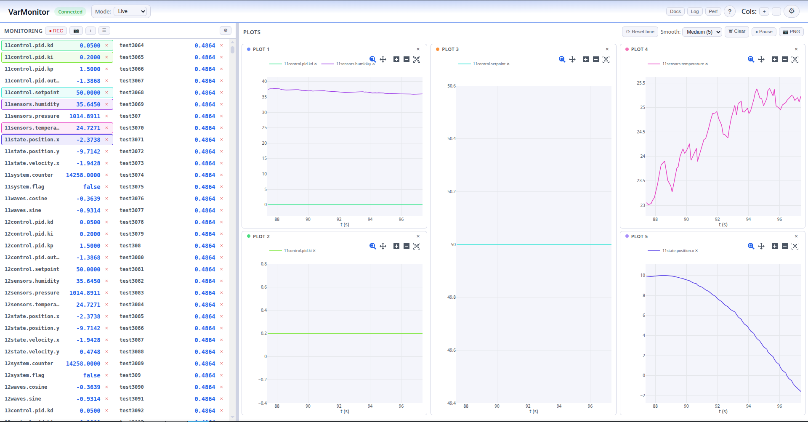
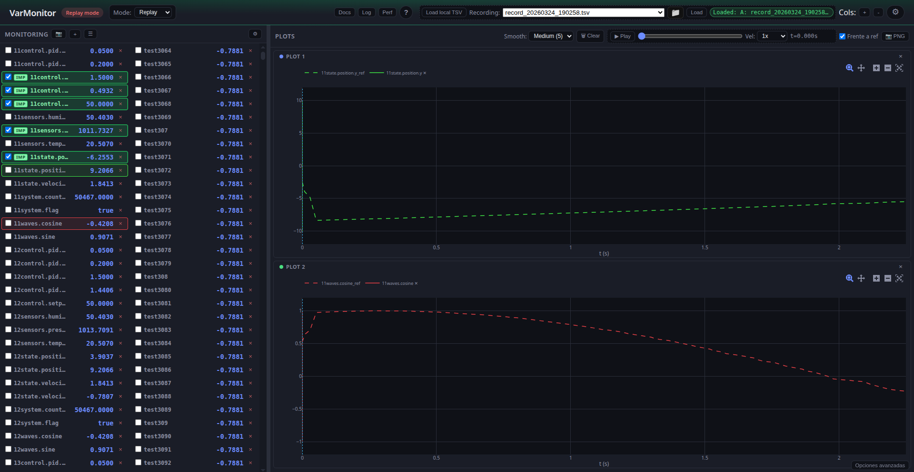

# VarMonitor

Sistema de monitorización de variables en tiempo real para aplicaciones C++20. La comunicación entre la aplicación C++ y el monitor web usa **Unix Domain Sockets (UDS)** y **memoria compartida (SHM)** con semáforos POSIX.

**Código fuente**: [VarMonitor en GitHub](https://github.com/LorenzoAdr/RealTimeMonitor).

## Capturas de la interfaz

Vista general en **tema claro** y **tema oscuro** (cabecera con modo Live/Análisis/Replay, monitor, gráficos y controles).

{ width="100%" }

{ width="100%" }

- **Modo análisis** (grabaciones offline TSV o Parquet): { width="100%" }
- **Modo replay** (referencia TSV + WebSocket): { width="100%" }
- **Opciones avanzadas** (anomalías, segmentos, notas, PDF…): { width="100%" }
- **Panel Perf** (fases Python / C++ / sidecar): { width="100%" }
- **Ayuda** (guía integrada): { width="100%" }
- **Visor de log** (backend y opcionalmente C++): { width="100%" }

## Qué encontrar en esta documentación

- **[Arquitectura](architecture.md)**: Componentes (C++, Python, frontend), flujo de datos, tasas visual e interna.
- **[Instalación y configuración](setup.md)**: Requisitos, instalación rápida, `varmon.conf`.
- **[Lanzadores](launch.md)**: `launch_demo`, `launch_web`, `launch_ui`; respaldo local en `scripts/_legacy_launch/`.
- **[Docker](docker.md)**: Contenedor del monitor web (modo puente o host para C++ en el mismo Linux).
- **[Backend (Python)](backend.md)**: `app.py`, descubrimiento de instancias, WebSocket, UdsBridge, ShmReader, alarmas y grabación.
- **[Frontend](frontend.md)**: Módulos ES (`entry.mjs`, `app-legacy.mjs`), columnas, gráficos Plotly, estado y persistencia.
- **[Protocolos](protocols.md)**: Formato UDS (longitud + JSON), comandos, layout SHM, mensajes WebSocket.
- **[Rendimiento](performance.md)**: SHM/UDS, panel Perf, `/api/perf`, optimizaciones del sidecar de grabación.
- **[Integración C++](cpp-integration.md)**: Cómo enlazar `libvarmonitor`, VarMonitor, `write_shm_snapshot`, macros.
- **[Resolución de problemas](troubleshooting.md)**: WSL/semáforos, "no conecta", gráficos vacíos, etc.

## Enlaces rápidos

- [VarMonitor en GitHub](https://github.com/LorenzoAdr/RealTimeMonitor) — código fuente, issues y contribuciones.
- El [README](../README.md) del repositorio contiene un resumen y la estructura del proyecto.
- Para generar y ver la documentación localmente: `mkdocs serve` (ES) o `mkdocs serve -f mkdocs.en.yml` (EN). Con el monitor en marcha, tras `mkdocs build` y `mkdocs build -f mkdocs.en.yml`, las URLs son **`/docs/es/`** y **`/docs/en/`** (o use el botón **Docs** con selector de idioma).
