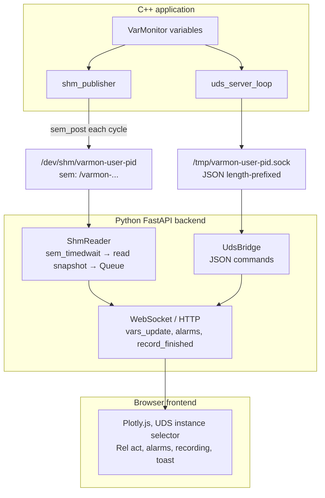

# Overall architecture

VarMonitor connects a C++ application to a web UI without TCP between C++ and Python: everything is local via **UDS** and **SHM**.

## Component diagram and data flow

- **No TCP** between C++ and Python: no network ports; UDS + SHM on the same machine.
- **web_port** in `varmon.conf` is only the HTTP/WebSocket port for the Python web server.

## Web backend: core and optional extensions

The public repository ships the FastAPI server (`web_monitor/app.py`), the plugin registry (`plugin_registry`), and an empty stub when no extra package is installed. Protocol registry APIs (ARINC / MIL-STD-1553), Git UI, terminal, GDB, and the server-side Parquet implementation are loaded from the optional Python package under `tool_plugins/python` (e.g. `pip install -e tool_plugins/python`). Without it, the monitor still works for variables, TSV recordings, WebSocket, and the MIT core routes described in [Backend (Python)](backend.md). See the section «Optional `varmonitor_plugins` package (Pro)» in `backend.md`.

## Instance discovery

The network is not scanned by IP/port. C++ instances are discovered via **Unix sockets** under `/tmp`:

1. **Name pattern**: `/tmp/varmon-<user>-<pid>.sock`
   - `user`: system user (`USER` env or `getpwuid(geteuid())` in C++).
   - `pid`: C++ process PID.

2. **How the Python backend lists them** (`_list_uds_instances` in `app.py`):
   - `glob.glob("/tmp/varmon-*.sock")` or, when filtered by user, `glob.glob("/tmp/varmon-<user>-*.sock")`.
   - For each path, opens a temporary UDS connection (`UdsBridge(path, timeout=0.6)`), calls `get_server_info()` (`server_info` command), then closes.
   - Only instances that respond correctly to `server_info` are kept.
   - `user` and `pid` are parsed from the filename (e.g. `varmon-juan-12345.sock` → user=`juan`, pid=`12345`).
   - **Order**: sorted by **socket mtime** (newest first) so the default instance is the most recent.

3. **REST API**: `GET /api/uds_instances?user=<optional>` returns `{"instances": [{ "uds_path", "pid", "uptime_seconds", "user" }, ...]}`.

4. **Frontend**: the "Instance" selector fills a `<select>`; each option has `value="uds:<uds_path>"`. If the user does not choose, the backend uses the first instance in the list when accepting the WebSocket.

## Initial connection and first messages

### 1. Browser → backend (WebSocket)

- The frontend opens `ws://<host>/ws` (optionally `?uds_path=<path>&password=...`).
- If `uds_path` is omitted, the backend calls `_list_uds_instances(None)` and picks the first instance as `uds_path`.

### 2. Backend → C++ (UDS)

- An `UdsBridge(uds_path, timeout=5.0)` is created and connects to the Unix socket.
- **First required message**: `get_server_info()` → sends `server_info` over UDS and reads the response.
- Response includes: `uds_path`, `shm_name`, `sem_name`, `uptime_seconds`, `memory_rss_kb`, `cpu_percent` (when available).

### 3. Shared memory segment association

- There is **one segment per C++ process** (per VarMonitor instance): name `varmon-<user>-<pid>`.
- The backend, **per WebSocket connection**, picks **one** UDS instance. From that instance it gets `shm_name` and `sem_name` via `server_info`. Then:
  - It creates **one** `ShmReader` (thread that reads that segment and semaphore and pushes snapshots to a queue).
  - That WebSocket uses only that segment/semaphore for `vars_update`, alarms and recording.
- Multiple C++ processes → multiple UDS and SHM pairs; each WebSocket client is tied to one instance.

### 4. Live data flow (SHM)

- **C++**: each cycle (e.g. every 10 ms) calls `write_shm_snapshot()` → writes SHM and `sem_post(sem)`.
- **Python**: the `ShmReader` thread does `sem_timedwait(sem, timeout)`; on signal, reads the snapshot, parses it and enqueues it. The WebSocket loop drains that queue, evaluates alarms, fills recording buffers and, at visual rate (Rel act), sends `vars_update` to the browser.
- **`sidecar_cpp` recording**: the publisher also `sem_post`s **`sem_sidecar_name`**; **`varmon_sidecar`** consumes that semaphore and writes the TSV in C++. Python keeps **`sem_name`**; SHM parsing for the UI during REC can be capped with **`shm_parse_hz_sidecar_recording`** (see [Performance](performance.md)).

## Two rates: visual vs monitoring

- **Visual rate (low)**: how often `vars_update` is sent to the browser. Controlled by **Rel act** (1 = every cycle, 5 by default). Only affects traffic to the browser.
- **Internal rate (high)**: the backend processes **every** snapshot (SHM or UDS): evaluates alarms, fills recording buffers. No cycles are skipped for alarms or recording.
- **Rel act 1**: maximum send rate to the browser when needed.
