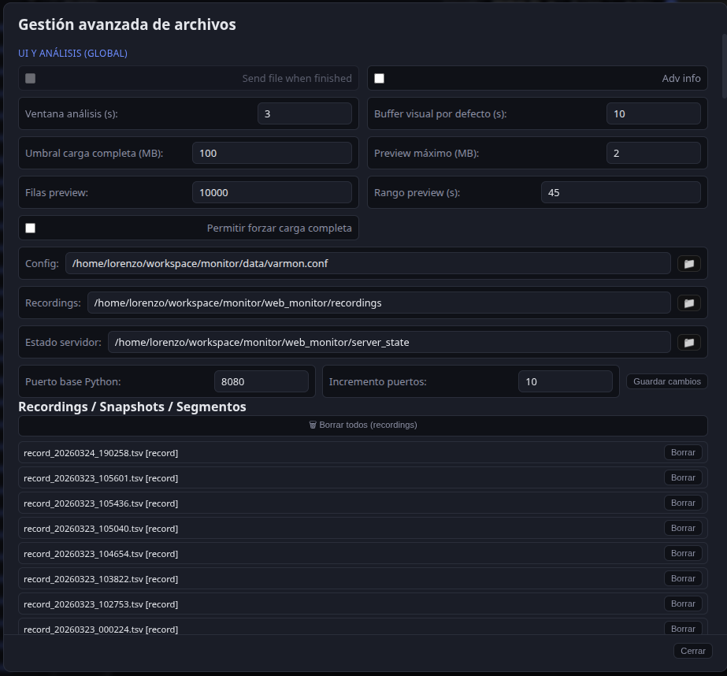

# VarMonitor

Real-time variable monitoring for C++20 applications. Communication between your C++ app and the web monitor uses **Unix Domain Sockets (UDS)** and **shared memory (SHM)** with POSIX semaphores.

**Source code**: [VarMonitor on GitHub](https://github.com/LorenzoAdr/RealTimeMonitor).

## Interface screenshots

General layout in **light** and **dark** theme (header with Live/Analysis/Replay, monitor column, plots).

{ width="100%" }

{ width="100%" }

- **Analysis mode** (offline TSV or Parquet recordings): { width="100%" }
- **Replay mode** (TSV reference + WebSocket): { width="100%" }
- **Advanced plot tools** (anomalies, segments, notes, PDF…): { width="100%" }
- **Perf panel** (Python / C++ / sidecar phases): { width="100%" }
- **Help** (in-app guide): { width="100%" }
- **Log viewer** (Python backend and optional C++ tail): { width="100%" }

## What you will find in this documentation

- **[Architecture](architecture.md)**: Components (C++, Python, frontend), data flow, visual vs internal rates.
- **[Installation and configuration](setup.md)**: Requirements, quick install, `varmon.conf`.
- **[Launch scripts](launch.md)**: `launch_demo`, `launch_web`, `launch_ui`; local backup under `scripts/_legacy_launch/`.
- **[Docker](docker.md)**: Web monitor container (bridge or host mode for C++ on the same Linux host).
- **[Backend (Python)](backend.md)**: `app.py`, instance discovery, WebSocket, UdsBridge, ShmReader, alarms and recording.
- **[Frontend](frontend.md)**: ES modules (`entry.mjs`, `app-legacy.mjs`), columns, Plotly charts, state and persistence.
- **[Protocols](protocols.md)**: UDS format (length + JSON), commands, SHM layout, WebSocket messages.
- **[Performance](performance.md)**: SHM/UDS, Perf panel, `/api/perf`, native recording sidecar optimizations.
- **[C++ integration](cpp-integration.md)**: Linking `libvarmonitor`, VarMonitor, `write_shm_snapshot`, macros.
- **[Troubleshooting](troubleshooting.md)**: WSL/semaphores, connection issues, empty charts, etc.

## Quick links

- [VarMonitor on GitHub](https://github.com/LorenzoAdr/RealTimeMonitor) — source, issues and contributions.
- The repository [README](../README.md) has a project overview and layout.
- To build and view this documentation locally: `mkdocs serve -f mkdocs.en.yml` (from the repo root) and open `http://localhost:8000`.
